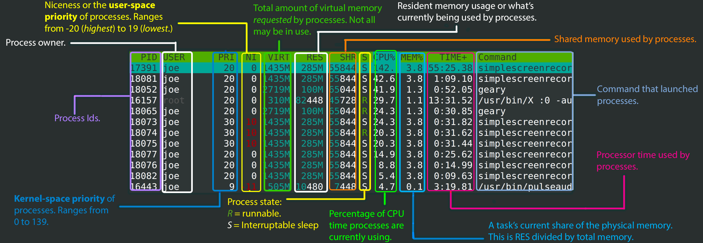

# Commands

## Contents
[General](#general) </br>
[echo](#echo) </br>
[whoami](#whoami) </br>
[id](#id) </br>
[ps](#ps) </br>
[top](#top) </br>
[htop](#htop) </br>
[kill](#kill) </br>
[pwd](#pwd) </br>
[echo](#echo) </br>
[ls](#ls) </br>
[cd](#cd) </br>


## General
- Linux is case sensitive
- Spaces matter

## echo
```
$ echo "Hello World"
Hello World
```

## whoami

- Gives you the current user's username

```
$ whoami
sanyi0411
```

## id

- Gives you the IDs and what groups the user belong to
- uid: User ID
- gid: Group ID, user's primary group ID
- groups: all the groups the user is a member of

```
$ id
uid=0(root) gid=0(root) groups=0(root)
```

- To find the ID of a given user:

```
$ id sanyi0411
uid=1234(sanyi0411) gid=2345(users) groups=1111(apple),2222(banana),3333(cinnamon)
```

- To get only the UID of a given user (number or name):

```
$ id -u sanyi0411
1234

$ id -nu sanyi0411
sanyi0411
```

- To get only the GID of a given user:

```
$ id -g sanyi0411
2345

$ id -ng sanyi0411
users
```

- To get all the groups a given user belongs to:

```
$ id -G sanyi0411
1111 2222 3333

$ id -nG sanyi0411
apple banana cinnamon
```

## ps

- "process status"
- UID: owner's user ID
- PID: process ID of the running process
- PPID: Parent process ID
    - Parent process: process that spwned this one
- C: CPU tilization of the process
- STIME: start time of the process
- TTY: the terminal associated with the process
- TIME: total CPU time used by the process
- CMD: the command that started the process
- Show processes for the current shell:
```
$ ps
    PID TTY          TIME CMD
2228759 pts/0    00:00:00 bash
2228788 pts/0    00:00:00 ps
```
- To list all processes on the system:
```
$ ps -e
    PID TTY          TIME CMD
      1 ?        00:00:15 systemd
      2 ?        00:00:00 kthreadd
...
```
- To display process tree:
```
$ ps -ejH
$ ps -ef --forest
```
- To list process with a given ID
```
$ ps p 345
$ ps -p 345
$ ps --pid 345
    PID TTY          TIME CMD
    245 ?        00:00:00 card1-crtc0
```
- To list all processes owned by you (same EUID as ps):
```
$ ps -x
    PID TTY      STAT   TIME COMMAND
    951 ?        Ss     0:00 /lib/systemd/systemd --user
    952 ?        S      0:00 (sd-pam)
...
```
- To list all processes whose executable name is given in cmdlist:
```
$ ps -C systemd
    PID TTY          TIME CMD
      1 ?        00:00:15 systemd
    951 ?        00:00:00 systemd
```
- To list all processes that were created by a given group:
```
$ ps -G sanyi0411
$ ps --Group sanyi0411
$ ps --G 1234
    PID TTY          TIME CMD
    951 ?        00:00:00 systemd
    952 ?        00:00:00 (sd-pam)
   1005 ?        00:00:12 pipewire
```

## top
- `top` is a dynamic and interactive tool that shows real-time detailed overview of the system performance
- displays CPU usage, memory  utilization, process activity, system load averages etc
```
$ top
$ top -p <PID>
```
- PID: unique process id of the given task
- USER: process owners username
- PR: process priority. Lower number means higher priority.
- NI: Nice Value of task. Negative value = higher priority, positive value = lower priority.
- VIRT: total virtual memory used by the process
- RES: physical RAM usage of the process (kilobytes)
- SHR: Shared Memory size (kb) used by a process
- %CPU: CPU usage of the process
- %MEM: Memory usage of the process
- TIME+: CPU Time, the same as ‘TIME’, but reflecting more granularity through hundredths of a second
- COMMAND: The name of the command that started the process
```
    PID USER      PR  NI    VIRT    RES    SHR S  %CPU  %MEM     TIME+ COMMAND                                                                                                                                   
2192632 sanyi04+  20   0 1376.0g 266928 113008 S   7.0   3.2  19:22.66 brave                                                                                                                                     
   1010 sanyi04+  20   0  610928  57664  48176 S   0.3   0.7 119:58.71 labwc                                                                                                                                     
1694620 sanyi04+  20   0 1114384  66848  39920 S   0.3   0.8  11:29.97 wf-panel-pi                                                                                                                               
1702282 root      20   0 1414928  25632  14336 S   0.3   0.3   5:02.40 containerd 
```
- while in `top` press 'k' to kill a process, then enter the process' PID
```
<press k>
PID to signal/kill [default pid = 2251] 
```
- to show CPU usage per core:
```
$ top -1
```

## htop
- interactive process viewer
- visually appealing and feature-rich alternative to `top`
- need to install first
```
$ sudo apt install htop
$ htop
```

source: https://codeahoy.com/


## kill
- to terminate a process use `kill`
- you need the PID of the process -> find it with `ps`
```
$ kill 1350
```

## pwd
- "print working directory"
- displays current location in the file system
```
$ pwd
/home/myuser
```

# echo
- Displays lines of text that are passed as arguments
```
$ echo "Hello World"
Hello World
```
- `$USER` is an environment variable that holds the name of the current user
```
$ echo $USER
sanyi0411
```
- `~` is an abbreviation for the current user's home directory
```
$ echo ~
/home/sanyi0411
```
- `-e` enables the interpretation of backslash escapes
- To create horizontal tab spaces
```
$ echo -e "Hello \tbeautiful \tworld"
Hello   beautiful       world
```

- Try the following backslash escapes as well:
    - `\b`
    - `\c`
    - `\n`
    - `\r`
    - `\v`
- Try displaying environment variables with `echo`

- You can redirect the output of echo (or any other command) into a file
```
$ echo "Hello World" > output.txt
```

## ls
- "list"
- lists files and directories in the given directory
- default it displays the contents of the current working directory:
```
$ ls
myfile mydirectory myotherfile
```
- to display the contents of a specific directory:
```
$ ls ~
myhomefile myotherhomefile
```
- `/` is the abbreviation for the root folder
```
$ ls /
bin  boot  dev  etc  home  lib  lost+found
```

- try the following options:
```
$ ls -a
$ ls -l
$ ls -al
$ ls -t
$ ls -R
$ ls -r
```
- handy way to see in a large directory which files were last changed:
```
$ ls -lrt
```

## cd
- "change directory"
- you can specify a relative path from your current working directory
```
$ pwd
/home/sanyi0411
$ cd Downloads
$ pwd
/home/sanyi0411/Downloads
```
- the `.` is an abbreviation for the current directory, so if a path starts with `.` it is a relative path
```
$ cd ./Downloads/MySongs
```
- you can specify an absolute path from the root directory `/`
```
$ pwd
/home/sanyi0411
$ cd /media/Movies
$ pwd
/media/Movies
```
- to `..` is an abbreviation for the parent folder of the current folder, so it means one folder up
```
$ pwd
/home/sanyi0411
$ cd ../../media/Movies
$ pwd
/media/Movies
```
- if your directory name have space(s), use quotes around the path or use backslash to escape the spaces
```
$ cd "/home/My User/My Secret Documents"
$ cd /home/My\ User/My\ Secret\ Documents
```
- to return to the previous directory you were at (not the parent):
```
$ cd -
```

## touch
- `touch` is used to 1) create a new empty file of any type or 2) update the access and modify timestamps of existing an file
- `touch` cannot create directory
```
$ touch file.txt
```
- try to write something is this file using the `echo` command
- you can create multiple files at once
```
$ touch file1.txt file2.txt file3.txt
```

## mkdir
- "make directory"
- creates a new empty directory
- you can use a relative path
```
$ mkdir MyDir
```
- or you can use an absolute path
```
$ mkdir /home/myuser/mystuff
```

## cp
- "copy"
- copies the file in it's first argument to the position given in the second argument
```
$ cp myfile.txt myfile_copy.txt
$ cp /home/myuser/Downloads /home/myuser/Documents
```
- to copy a file into a folder:
    - in this case the new file's name will be the same as the original file's name
```
$ cp myfile.txt testdirectory/
```

## mv
- "move"
- it can move a file from the location given in the first argument, to the location in the second argument
```
$ move file.txt testdir/
```
- if you move the file to the same directory as it were in, then you rename the file:
```
$ cd myfile.txt myfilerenamed.txt
```
- you can also use it to rename a directory:
```
$ mv mydir mydir_copy
```
- you can combine moving and renaming into one command
```
$ mv /home/sanyi/Downloads/temp.txt /home/sanyi0411/Documents/final.txt
```

## rm
- "remove"
- removes or deletes files and folders (directories)
```
$ rm myoldfile.txt
$ rm myolddir
```
- use the `-i` option for interactive deleting
    - this prompts you for conformation before deleting each file
```
$ rm -i file5.txt
$ rm -i notusedfolder
```
- to remove a directory, all its files, and do it recursively for every directory within:
```
$ rm -r testdirectory
```